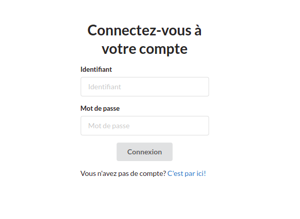
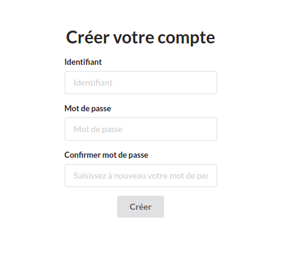

# shop-crm

SpringBoot application example with 3 pages : user login, user registration and welcome page.

### Login to docker hub from host
> docker login

### Build Docker image
> docker build . -t shop-crm-server

### Tag image
> docker tag shop-crm-server:latest dada971/shop-crm-server

### Push image to docker hub
> docker push dada971/shop-crm-server
